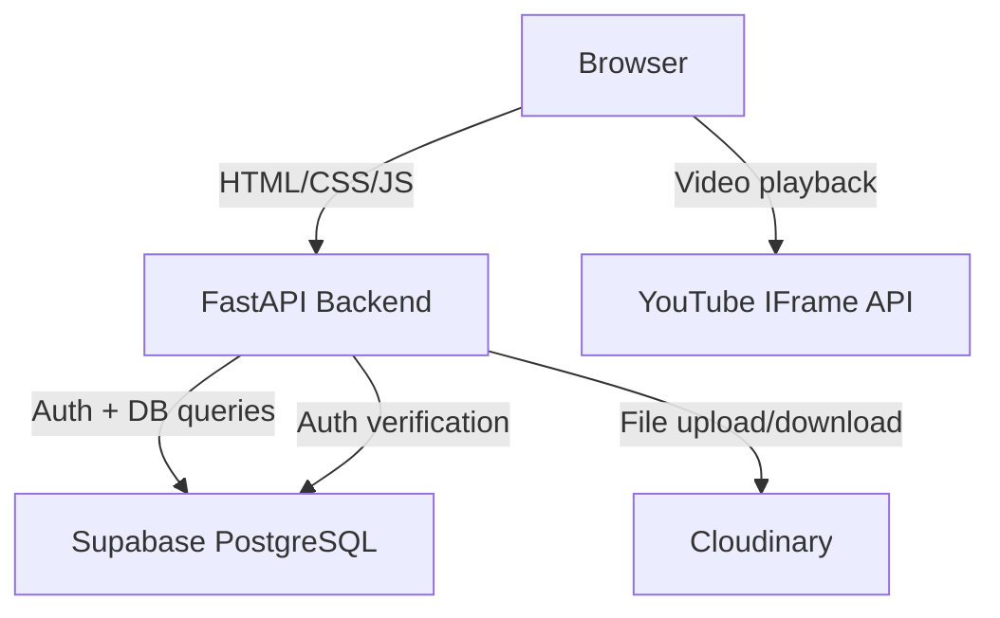

# Architecture Document

## 1. High-Level App Flow

```
User opens app
    |
    v
[Frontend: HTML + Tailwind + JS]
    |
    v
[FastAPI Backend]
    |
    +---> [Supabase: PostgreSQL DB + Auth]
    |
    +---> [Cloudinary: Video comment storage]
    |
    +---> [YouTube IFrame API: Video playback]
```

### User Journey

1. User visits Home page → sees grid of videos
2. User clicks a video → navigates to Watch page
3. YouTube video plays via IFrame embed
4. User scrolls down to comment section
5. User writes text comment OR records/uploads video comment
6. Optionally pins comment to current timestamp
7. Comment is sent to FastAPI backend
8. Backend stores in Supabase DB (+ Cloudinary for video clips)
9. Frontend fetches comments and renders threaded tree
10. User can reply to any comment → forms a thread

## 2. System Architecture



## 3. Folder & File Structure

```
comment_video/
├── backend/
│   ├── main.py                 # FastAPI app entry point
│   ├── requirements.txt        # Python dependencies
│   ├── config.py               # Environment variables / settings
│   ├── routers/
│   │   ├── videos.py           # Video CRUD endpoints
│   │   ├── comments.py         # Comment CRUD endpoints
│   │   └── auth.py             # Auth endpoints (Supabase)
│   ├── models/
│   │   ├── video.py            # Video Pydantic model
│   │   ├── comment.py          # Comment Pydantic model
│   │   └── user.py             # User Pydantic model
│   ├── services/
│   │   ├── supabase_client.py  # Supabase client initialization
│   │   ├── cloudinary_client.py# Cloudinary client setup
│   │   └── youtube.py          # YouTube URL parsing / validation
│   └── middleware/
│       └── auth.py             # Auth middleware (Supabase JWT)
├── frontend/
│   ├── index.html              # Home page
│   ├── watch.html              # Watch page
│   ├── channel.html            # Channel page
│   ├── search.html             # Search page
│   ├── auth.html               # Login / signup page
│   ├── css/
│   │   └── styles.css          # Tailwind + custom styles
│   ├── js/
│   │   ├── api.js              # API client (fetch calls to FastAPI)
│   │   ├── player.js           # YouTube IFrame player logic
│   │   ├── comments.js         # Comment rendering + threading
│   │   ├── video-comment.js    # Video recording/upload logic
│   │   ├── theme.js            # Light/dark mode toggle
│   │   └── auth.js             # Auth state management
│   └── assets/
│       └── images/             # Static images/icons
├── docs/
│   ├── PRD.md
│   ├── architecture.md
│   ├── rules.md
│   ├── phases.md
│   ├── design.md
│   └── memory.md
├── .env.example                # Environment variable template
└── README.md
```

## 4. Tech Stack

| Concern | Choice | Justification |
|---|---|---|
| Backend | **FastAPI** (Python) | Async, auto-generates API docs, fast development, type-safe with Pydantic |
| Frontend | **HTML + Tailwind CSS** | Simple, no build step, fast to prototype, works well with server-rendered or static pages |
| Database | **Supabase (PostgreSQL)** | Free tier, managed Postgres, built-in auth and real-time subscriptions |
| Auth | **Supabase Auth** | Tightly coupled with Supabase DB, handles JWT tokens, social login ready |
| Video comment storage | **Cloudinary** | Free tier, built-in video compression, thumbnail generation, CDN |
| Video playback | **YouTube IFrame API** | Free, no hosting needed, exposes playback time for timestamp features |
| Hosting | **Vercel** (frontend) + **Supabase** (backend) | Free tiers suitable for development/demo |
